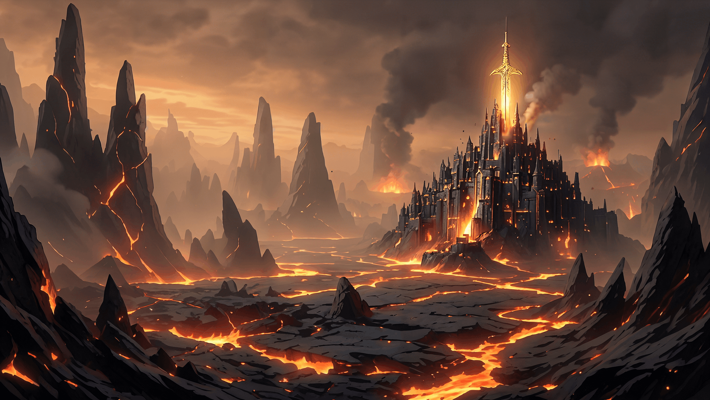

+++
date = '2026-03-16T15:02:30-04:00'
draft = true
title = 'Domain of Fire'
+++

## Domain Information

Aodh is a realm of brutal, molten beauty. Its landscape is carved from towering basalt spires and active volcanoes, between which rivers of incandescent lava flow like slow, burning arteries. The air is perpetually warm and thick with the scent of soot and hot metal.
Here, society is forged in the same fires as its legendary steel. The people—content, pragmatic, and fiercely hardworking—are master metallurgists and smiths. Their cities are not mere settlements but formidable fortresses of black stone, inlaid with veins of copper, brass, and gold wrested from deep mines.
At the domain’s heart rises its greatest fortress, the **Cathair nan Lasair** (Seat of the Flames). This city-sized basalt spire is a monument of martial power, its walls threaded with gold and capped with gleaming spires. Piercing its very core is a massive golden sword—a permanent, dazzling testament to a past Prince’s god-slaying might, and a blunt reminder of the power that now resides there.
For that seat is held by **Ludvillia Beòlach**, the youngest and most volatile of the Princes. Her rule is as direct and heated as her domain, her personal flame a constant spark in a land that is both a glorious forge and a powder keg awaiting her next impulsive command.

## Ludvillia Art



---


  
   
  
